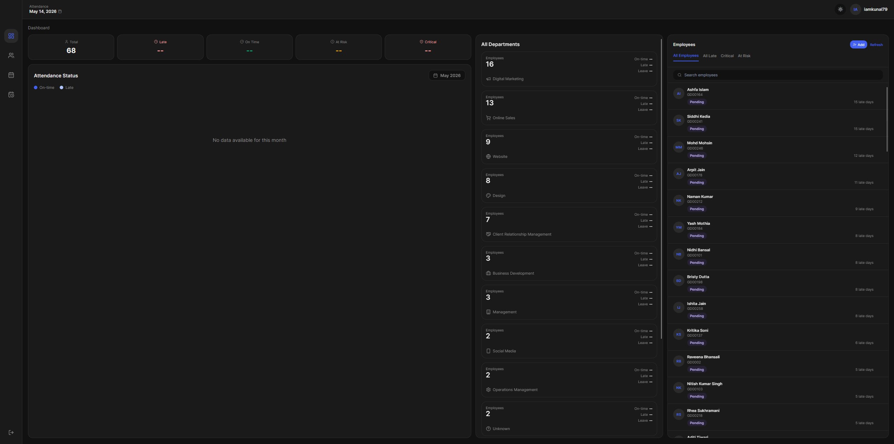
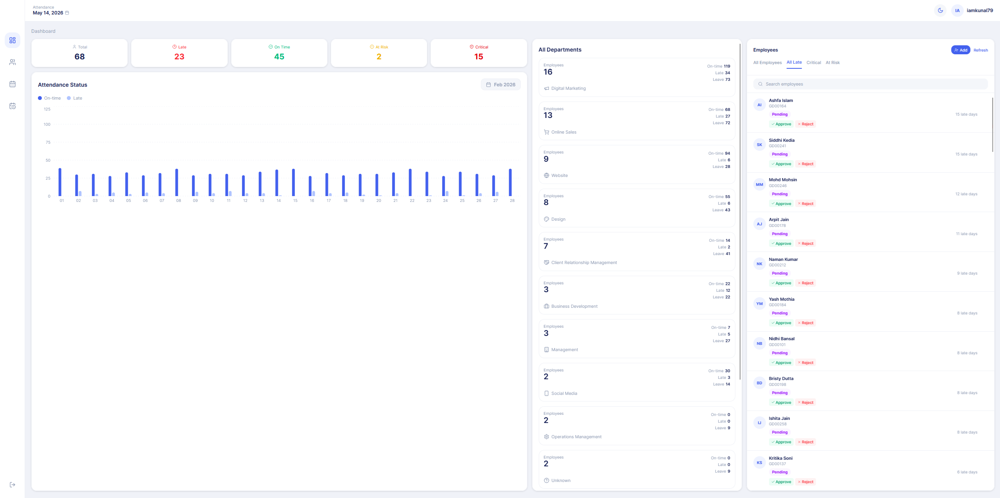
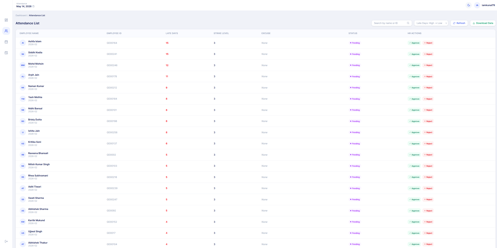
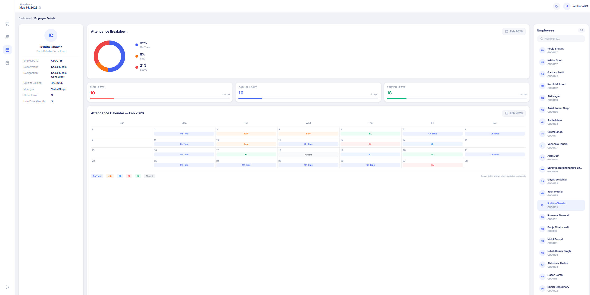
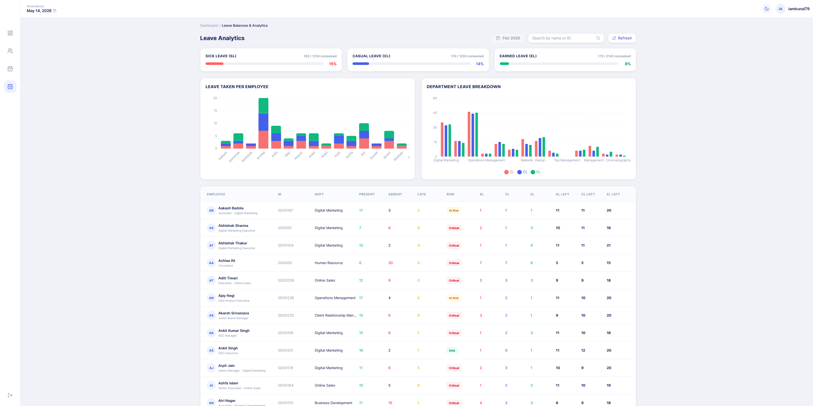
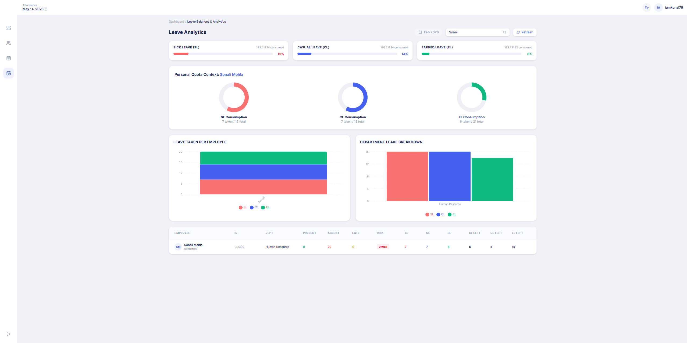
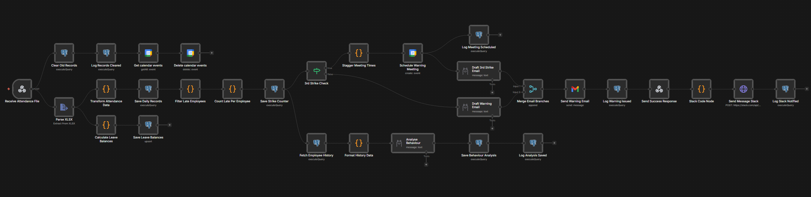
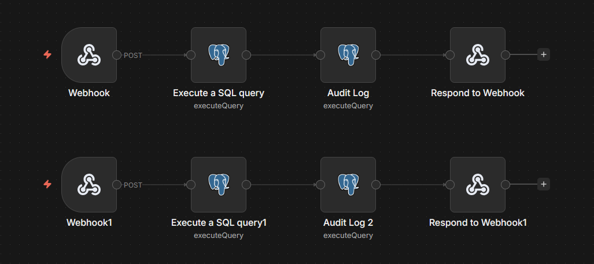

<div align="center">

# Punctual.ai

**An AI-powered Attendance & HR Management System with Automated Workflows**

[](https://www.typescriptlang.org/)
[](https://reactjs.org)
[](https://vitejs.dev)
[](https://supabase.com)
[](https://n8n.io)
[](https://ollama.com)
<br>
[](https://mail.google.com)
[](https://slack.com)
[](https://calendar.google.com)

</div>

---

## Overview

Punctual.ai is a comprehensive HR attendance automation system that streamlines the entire lifecycle of employee tracking. By leveraging **n8n** workflows to ingest monthly Excel muster reports, the system automatically parses punch-in/punch-out times, classifies daily status codes (Present, Absent, Off, Late Coming), and upserts structured records into a **Supabase PostgreSQL** database.

---

## Features

### 🖥️ Role-Based Dashboards (React & TypeScript)
- **Admin Dashboard** — Engineered for real-time attendance monitoring and comprehensive workforce analytics.
- **Leave Management** — Advanced leave balance tracking powered by **Recharts** visualizations.
- **Interactive Appeals** — Direct approval or rejection of employee excuse appeals that feed back into the automation workflow.
- **Employee Portal** — Personal attendance calendar with deterministic status badges and quota tracking.
- **Rich Data Visualizations**:
  - **Recharts Integration** — Dynamic bar charts and **Donut Quota Rings** for trend analysis.
  - **KPI Burn-Down Bars** — High-level indicators for monitoring leave utilization.
  - **Status Calendar** — A color-coded monthly view for tracking daily attendance codes.

### ⚙️ Intelligent Automation (n8n & AI)
- **Automated Ingestion** — Intelligent parsing of Excel muster reports into structured records.
- **AI-Driven Analysis** — Integrated **Ollama (local LLM)** to analyze employee behavior and identify attendance patterns.
- **Multi-Channel Notifications**:
  - **Gmail API** — Personalised, AI-drafted warning emails sent directly to employee inboxes.
  - **Slack API** — Real-time notifications and third-strike notices posted to team Slack channels.
  - **Google Calendar API** — Automated scheduling of mandatory warning meetings for chronic tardiness.
- **Workflow Audit Trail** — Implemented a timestamped logging system after every significant automation node for full admin visibility.
- **Excuse Overrides** — Webhook-based system for manual HR overrides and automated appeal processing.

---

## Tech Stack

<div align="center">

[](https://tailwindcss.com)
[](https://www.postgresql.org/)
[](https://n8n.io)
[](https://supabase.com)

</div>

<br>

| Layer            | Tools                                      |
| ---------------- | ------------------------------------------ |
| **Frontend**     | React 18, TypeScript, Vite, Tailwind CSS   |
| **Backend/DB**   | Supabase (PostgreSQL), Audit Logging       |
| **Automation**   | n8n Workflows                              |
| **AI Engine**    | Ollama (Llama 3.2:3b)                      |
| **Integrations** | Gmail, Google Calendar, Slack API          |

---

## Project Structure

```
punctual.ai/
├── src/
│   ├── app/
│   │   ├── pages/             # Dashboard, Employee Portal, Leave Balances
│   │   └── components/        # Reusable UI components
│   ├── lib/                   # Supabase client and utilities
│   └── styles/                # Global CSS and Tailwind configurations
├── Attendance System.json      # Main n8n workflow for data processing
├── HR Override & Appeals.json  # Workflow for manual HR interventions
├── public/                    # Static assets and icons
├── package.json               # Frontend dependencies
└── README.md                  # Project documentation
```

---

## Getting Started

### Prerequisites

- Node.js 18+
- Supabase Account (with PostgreSQL)
- n8n instance (Self-hosted or Cloud)
- Ollama (running locally for AI features)

### Installation

1. **Clone the repository**

   ```bash
   git clone https://github.com/lowkeyypal/punctual.ai.git
   cd punctual.ai
   ```

2. **Install frontend dependencies**

   ```bash
   npm install
   ```

3. **Configure Environment**
   Create a `.env` file and add your Supabase credentials.

4. **Import n8n Workflows**
   Import the `.json` files in the root directory into your n8n instance and configure the Postgres/Gmail/Slack credentials.

5. **Run the application**
   ```bash
   npm run dev
   ```

---

## How it Works

### The Workflow Lifecycle

| Phase              | Action                                                                                 |
| ------------------ | -------------------------------------------------------------------------------------- |
| **1. Data Ingest** | Upload an attendance XLSX file via the dashboard webhook.                              |
| **2. Processing**  | n8n parses the file, calculates late flags, and updates Supabase.                      |
| **3. AI Analysis** | Llama 3.2 analyzes historical patterns and predicts employee risk levels.              |
| **4. Escalation**  | If 3 strikes are reached: Google Calendar schedules a meeting & Gmail sends a warning. |
| **5. Reporting**   | A formatted summary of all warnings is posted to the HR Slack channel.                 |
| **6. Override**    | HR can manually excuse or reject strikes via the "Override" portal.                    |

---

## Screenshots

<div align="center">
   
  <br>
   
  <br>
   
  <br>
   
</div>

---

## Browser Compatibility

| Browser | Support      |
| ------- | ------------ |
| Chrome  | Recommended  |
| Edge    | Full support |
| Firefox | Full support |
| Safari  | Full support |

---

## Troubleshooting

**n8n Workflow failing?**

- Ensure your Postgres database is accessible from the n8n instance.
- Check that all credentials (Gmail, Slack, Ollama) are properly configured in n8n.

**AI analysis slow?**

- Ensure Ollama is running and the `llama3.2:3b` model is downloaded locally (`ollama pull llama3.2`).

---

## License

Open source — feel free to modify and use.
